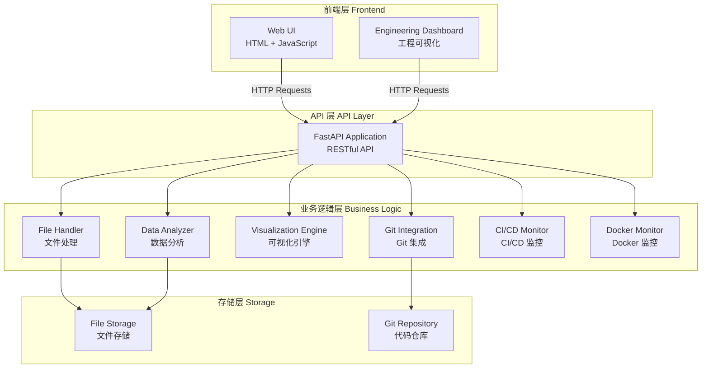
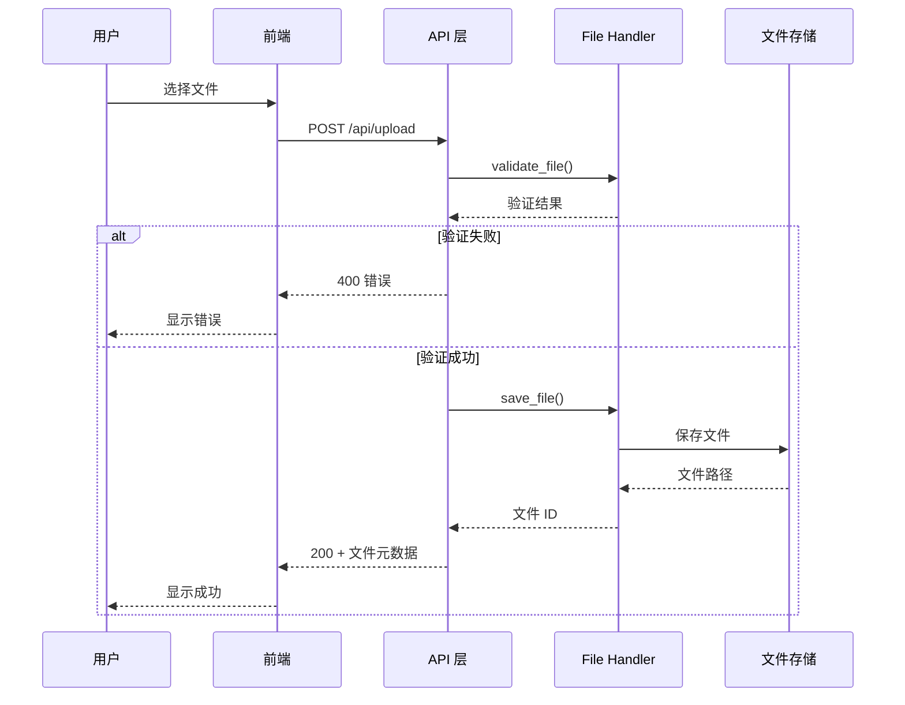
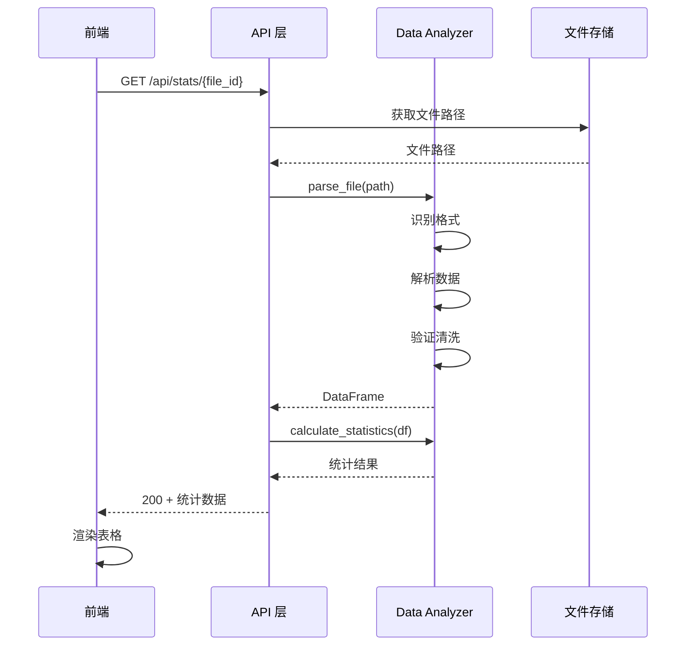
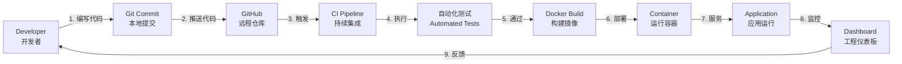

# ECU Log Visualizer - 技术说明与操作手册

**版本**: 1.0.0  
**最后更新**: 2026-03-04  
**文档状态**: 正式版

---

## 目录

1. [项目概览](#1-项目概览-project-overview)
2. [技术亮点](#2-技术亮点-engineering-highlights)
3. [系统架构](#3-系统架构-system-architecture)
4. [工程架构](#4-工程架构-software-engineering-pipeline)
5. [项目目录结构](#5-项目目录结构-project-structure)
6. [安装与运行指南](#6-安装与运行指南-quick-start)
7. [Docker 运行方式](#7-docker-运行方式)
8. [CI/CD 工作流程](#8-cicd-工作流程)
9. [Engineering Dashboard](#9-engineering-dashboard)
10. [操作流程](#10-操作流程-operation-guide)
11. [系统原理说明](#11-系统原理说明-for-interns--learning)
12. [系统复现指南](#12-系统复现指南-reproduction-guide)
13. [故障排查](#13-故障排查-troubleshooting)
14. [未来扩展](#14-未来扩展-future-improvements)

---

## 1. 项目概览 (Project Overview)

### 1.1 系统解决什么问题

在汽车电子系统开发中，电子控制单元（ECU）会产生大量的运行日志数据。这些日志包含传感器读数、状态信息和时间戳。工程师需要：

- **快速分析**大量日志数据
- **可视化**传感器数据趋势
- **识别异常**读数和故障模式
- **导出数据**用于进一步分析

传统方式需要手动打开日志文件、使用 Excel 处理数据、绘制图表，效率低下且容易出错。

**ECU Log Visualizer 提供了一站式解决方案**：
- 上传日志文件（CSV 或 JSON 格式）
- 自动解析和统计分析
- 生成交互式可视化图表
- 支持数据过滤和导出

### 1.2 系统主要功能

| 功能模块 | 说明 | 用户价值 |
|---------|------|---------|
| **文件上传** | 支持 CSV 和 JSON 格式日志 | 灵活支持不同数据源 |
| **数据解析** | 自动提取时间戳和传感器数据 | 无需手动处理数据 |
| **统计分析** | 计算最小值、最大值、平均值、标准差 | 快速了解数据特征 |
| **可视化** | 交互式折线图，支持缩放和平移 | 直观观察数据趋势 |
| **数据过滤** | 按时间范围和传感器类型过滤 | 聚焦关注的数据 |
| **数据导出** | 导出过滤后的数据为 CSV/JSON | 支持二次分析 |

### 1.3 系统应用场景

**场景 1：日常测试分析**
- 测试工程师上传测试日志
- 查看传感器读数是否在正常范围
- 导出异常数据段用于报告

**场景 2：故障诊断**
- 客户反馈车辆异常
- 上传故障时的 ECU 日志
- 通过可视化快速定位异常时间点
- 分析相关传感器数据

**场景 3：性能优化**
- 对比不同版本软件的 ECU 日志
- 分析性能指标变化
- 验证优化效果

**场景 4：团队协作**
- 工程师上传日志并分享文件 ID
- 团队成员查看相同数据
- 统一分析标准

---

## 2. 技术亮点 (Engineering Highlights)

本系统不仅是一个功能性应用，更是一个**现代软件工程实践的示范项目**。

### 2.1 Git 版本控制

**解决什么问题**：
- 代码变更追踪
- 团队协作开发
- 版本回退能力

**在系统中的作用**：
- 所有代码通过 Git 管理
- 清晰的提交历史
- 支持多人协作开发

**技术价值**：
- 代码可追溯性
- 变更审计能力
- 团队协作基础


### 2.2 GitHub 远程仓库

**解决什么问题**：
- 代码集中托管
- 远程备份
- 团队协作平台

**在系统中的作用**：
- 代码托管在 GitHub
- 支持 Pull Request 代码审查
- 触发自动化 CI/CD 流程

**技术价值**：
- 代码安全备份
- 协作开发平台
- 开源社区支持

### 2.3 CI/CD 自动化 (GitHub Actions)

**解决什么问题**：
- 手动测试耗时
- 人为错误风险
- 部署流程不一致

**在系统中的作用**：
- 每次代码提交自动运行测试
- 自动检查代码质量
- 自动构建 Docker 镜像

**技术价值**：
- 提前发现问题
- 保证代码质量
- 加快交付速度

**工作流程**：
```
代码提交 → 自动触发 CI → 安装依赖 → 代码检查 → 运行测试 → 构建验证
```

### 2.4 Docker 容器化

**解决什么问题**：
- "在我机器上能运行"问题
- 环境配置复杂
- 部署不一致

**在系统中的作用**：
- 应用打包为 Docker 镜像
- 一次构建，到处运行
- 隔离的运行环境

**技术价值**：
- 环境一致性
- 快速部署
- 资源隔离

### 2.5 Jenkins Pipeline

**解决什么问题**：
- 企业级 CI/CD 需求
- 复杂构建流程管理
- 多环境部署

**在系统中的作用**：
- 提供 Jenkinsfile 配置
- 支持企业 Jenkins 环境
- 多阶段构建流程

**技术价值**：
- 企业级 CI/CD 支持
- 灵活的流程定义
- 可视化构建过程

### 2.6 自动化测试

**解决什么问题**：
- 手动测试覆盖不全
- 回归测试耗时
- 代码质量难以保证

**在系统中的作用**：
- 单元测试：测试独立模块
- 集成测试：测试 API 端点
- 属性测试：测试通用属性

**技术价值**：
- 代码质量保证
- 快速发现问题
- 支持重构

**测试覆盖**：
- 文件处理模块
- 数据解析模块
- 统计计算模块
- API 端点
- 前端功能

### 2.7 数据可视化

**解决什么问题**：
- 数据难以理解
- 趋势不明显
- 异常难以发现

**在系统中的作用**：
- 使用 Plotly 生成交互式图表
- 支持多传感器叠加显示
- 支持缩放、平移、悬停查看

**技术价值**：
- 直观的数据展示
- 交互式探索
- 专业级可视化

### 2.8 工程可视化系统 (Engineering Dashboard)

**解决什么问题**：
- 工程流程不透明
- 管理层难以理解技术工作
- 团队状态不可见

**在系统中的作用**：
- 展示 Git 提交历史
- 展示 CI/CD 运行状态
- 展示 Docker 容器状态
- 展示测试结果

**技术价值**：
- 工程透明化
- 管理可视化
- 团队协作增强

---

## 3. 系统架构 (System Architecture)

### 3.1 整体架构

ECU Log Visualizer 采用**前后端分离架构**，由以下层次组成：



### 3.2 核心模块说明

#### 3.2.1 文件处理模块 (File Handler)

**职责**：
- 验证上传文件格式（CSV/JSON）
- 检查文件大小（最大 50MB）
- 生成唯一文件标识符（UUID）
- 保存文件到 uploads/ 目录

**关键方法**：
```python
validate_file(file)  # 验证文件
save_file(file)      # 保存文件
get_file_path(id)    # 获取文件路径
delete_file(id)      # 删除文件
```

**数据流**：
```
用户上传 → 格式验证 → 大小检查 → 生成 UUID → 保存文件 → 返回文件 ID
```


#### 3.2.2 数据分析模块 (Data Analyzer)

**职责**：
- 解析 CSV 和 JSON 格式日志
- 提取时间戳和传感器数据
- 数据验证和清洗
- 计算统计信息（min, max, mean, std）
- 数据过滤（时间范围、传感器）

**关键方法**：
```python
parse_file(path)              # 解析文件
parse_csv(path)               # 解析 CSV
parse_json(path)              # 解析 JSON
validate_data(df)             # 验证数据
calculate_statistics(df)      # 计算统计
filter_data(df, filters)      # 过滤数据
get_sensor_names(df)          # 获取传感器列表
```

**数据流**：
```
文件路径 → 格式识别 → 解析数据 → 验证清洗 → 统计计算 → 返回结果
```

#### 3.2.3 可视化引擎 (Visualization Engine)

**职责**：
- 生成 Plotly 格式图表配置
- 支持时间序列折线图
- 支持多传感器叠加显示
- 配置交互功能（缩放、平移、悬停）

**关键方法**：
```python
create_time_series_chart(df, sensors)  # 创建时间序列图
_create_trace(df, sensor)              # 创建单个传感器轨迹
```

**数据流**：
```
DataFrame → 选择传感器 → 生成 traces → 配置 layout → 返回 Plotly JSON
```

#### 3.2.4 API 层 (FastAPI Application)

**职责**：
- 提供 RESTful API 端点
- 请求验证和参数解析
- 错误处理和响应格式化
- 自动生成 API 文档

**核心端点**：

| 端点 | 方法 | 功能 |
|------|------|------|
| `/api/upload` | POST | 上传日志文件 |
| `/api/stats/{file_id}` | GET | 获取统计信息 |
| `/api/chart/{file_id}` | GET | 获取图表数据 |
| `/api/export/{file_id}` | GET | 导出数据 |
| `/api/files` | GET | 获取文件列表 |
| `/api/engineering/dashboard` | GET | 获取工程仪表板数据 |

### 3.3 数据流图

#### 3.3.1 文件上传流程



#### 3.3.2 数据分析流程



### 3.4 模块间通信

**通信方式**：
- 前端 ↔ API：HTTP/HTTPS (RESTful)
- API ↔ 业务逻辑：Python 函数调用
- 业务逻辑 ↔ 存储：文件系统 I/O

**数据格式**：
- API 请求/响应：JSON
- 内部数据处理：Pandas DataFrame
- 文件存储：CSV/JSON 原始格式

---

## 4. 工程架构 (Software Engineering Pipeline)

### 4.1 完整工程流程



### 4.2 各环节详细说明

#### 步骤 1：开发者编写代码

**做什么**：
- 开发新功能或修复 bug
- 编写单元测试
- 本地运行测试验证

**为什么需要**：
- 功能开发的起点
- 本地验证减少错误

**工具**：
- 代码编辑器（VS Code, PyCharm）
- Python 3.9+
- Git

#### 步骤 2：Git Commit 本地提交

**做什么**：
- 使用 `git add` 暂存更改
- 使用 `git commit` 提交更改
- 编写清晰的提交信息

**为什么需要**：
- 记录代码变更历史
- 支持版本回退
- 团队协作基础

**示例**：
```bash
git add src/data_analyzer.py
git commit -m "feat: add JSON parsing support"
```

#### 步骤 3：Push 到 GitHub

**做什么**：
- 使用 `git push` 推送到远程仓库
- 代码同步到 GitHub

**为什么需要**：
- 代码集中管理
- 触发自动化流程
- 团队共享代码

**示例**：
```bash
git push origin main
```


#### 步骤 4：CI Pipeline 自动触发

**做什么**：
- GitHub Actions 自动检测到代码推送
- 启动 CI 工作流
- 创建隔离的测试环境

**为什么需要**：
- 自动化质量检查
- 避免人为遗漏
- 快速反馈

**配置文件**：`.github/workflows/ci.yml`

#### 步骤 5：自动化测试

**做什么**：
- 安装项目依赖
- 运行代码质量检查（flake8）
- 执行单元测试
- 执行集成测试
- 生成测试覆盖率报告

**为什么需要**：
- 确保代码质量
- 防止引入 bug
- 保证功能正确性

**测试类型**：
- 单元测试：测试独立函数
- 集成测试：测试 API 端点
- 属性测试：测试通用属性

#### 步骤 6：Docker Build 构建镜像

**做什么**：
- 使用 Dockerfile 构建应用镜像
- 打包应用和所有依赖
- 创建可部署的容器镜像

**为什么需要**：
- 环境一致性
- 简化部署
- 隔离运行环境

**构建命令**：
```bash
docker build -t ecu-log-visualizer:latest .
```

#### 步骤 7：Container 运行容器

**做什么**：
- 从镜像启动容器
- 映射端口
- 配置环境变量

**为什么需要**：
- 隔离的运行环境
- 快速启动和停止
- 资源管理

**运行命令**：
```bash
docker run -d -p 8000:8000 --name ecu-log-visualizer ecu-log-visualizer:latest
```

#### 步骤 8：Application 应用运行

**做什么**：
- FastAPI 应用启动
- 监听 HTTP 请求
- 提供 API 服务

**为什么需要**：
- 提供用户服务
- 处理业务逻辑

**访问地址**：
- 应用：http://localhost:8000
- API 文档：http://localhost:8000/docs

#### 步骤 9：Dashboard 工程仪表板监控

**做什么**：
- 展示 Git 提交历史
- 展示 CI/CD 运行状态
- 展示 Docker 容器状态
- 展示测试结果

**为什么需要**：
- 工程透明化
- 快速发现问题
- 团队协作

**访问地址**：http://localhost:8000/engineering-dashboard.html

---

## 5. 项目目录结构 (Project Structure)

```
ecu-log-visualizer/
│
├── .github/                          # GitHub 配置
│   └── workflows/
│       └── ci.yml                    # GitHub Actions CI 配置
│
├── .kiro/                            # Kiro 项目配置
│   └── specs/                        # 规范文档
│       ├── ecu-log-visualizer/       # 主功能规范
│       └── engineering-delivery-toolchain/  # 工程工具链规范
│
├── docs/                             # 项目文档
│   ├── configuration.md              # 配置说明
│   ├── log_format.md                 # 日志格式说明
│   ├── demo.md                       # 演示指南
│   ├── maintenance.md                # 维护指南
│   ├── github-setup.md               # GitHub 设置指南
│   ├── engineering-toolchain.md      # 工程工具链说明
│   └── system_manual.md              # 本文档
│
├── examples/                         # 示例数据
│   ├── sample_ecu_log.csv            # CSV 格式示例
│   └── sample_ecu_log.json           # JSON 格式示例
│
├── frontend/                         # 前端文件
│   ├── index.html                    # 主页面
│   ├── app.js                        # 应用逻辑
│   ├── styles.css                    # 样式文件
│   ├── engineering-dashboard.html    # 工程仪表板页面
│   ├── engineering-dashboard.js      # 仪表板逻辑
│   └── engineering-dashboard.css     # 仪表板样式
│
├── scripts/                          # 自动化脚本
│   ├── dev.sh                        # 开发环境设置
│   ├── test.sh                       # 运行测试
│   ├── build.sh                      # 构建 Docker 镜像
│   └── deploy.sh                     # 部署应用
│
├── src/                              # 源代码
│   ├── main.py                       # FastAPI 应用主文件
│   ├── models.py                     # 数据模型定义
│   ├── file_handler.py               # 文件处理模块
│   ├── data_analyzer.py              # 数据分析模块
│   ├── visualization_engine.py       # 可视化引擎
│   ├── error_handler.py              # 错误处理
│   ├── git_integration.py            # Git 集成（待实现）
│   ├── cicd_status.py                # CI/CD 监控（待实现）
│   └── docker_status.py              # Docker 监控（待实现）
│
├── tests/                            # 测试文件
│   ├── unit/                         # 单元测试
│   │   ├── test_file_handler.py
│   │   ├── test_data_analyzer.py
│   │   ├── test_visualization_engine.py
│   │   └── test_models.py
│   ├── integration/                  # 集成测试
│   │   ├── test_api_upload.py
│   │   ├── test_api_stats.py
│   │   ├── test_api_chart.py
│   │   └── test_api_export.py
│   └── property/                     # 属性测试
│       └── test_properties_visualization.py
│
├── uploads/                          # 上传文件存储目录
│   └── .gitkeep
│
├── .dockerignore                     # Docker 构建排除文件
├── .gitignore                        # Git 忽略文件
├── CHANGELOG.md                      # 变更日志
├── Dockerfile                        # Docker 镜像定义
├── Jenkinsfile                       # Jenkins Pipeline 定义
├── pytest.ini                        # pytest 配置
├── README.md                         # 项目说明
├── requirements.txt                  # Python 依赖
├── run_server.py                     # 服务器启动脚本（Python）
└── run_server.sh                     # 服务器启动脚本（Shell）
```

### 5.1 关键目录说明

#### `src/` - 源代码目录
包含所有 Python 源代码，按模块组织：
- **main.py**: FastAPI 应用入口，定义所有 API 端点
- **models.py**: Pydantic 数据模型，用于请求/响应验证
- **file_handler.py**: 处理文件上传、验证、存储
- **data_analyzer.py**: 解析日志、计算统计、过滤数据
- **visualization_engine.py**: 生成 Plotly 图表配置
- **error_handler.py**: 全局错误处理和日志记录

#### `tests/` - 测试目录
包含三类测试：
- **unit/**: 单元测试，测试独立模块功能
- **integration/**: 集成测试，测试 API 端点
- **property/**: 属性测试，使用 Hypothesis 测试通用属性

#### `frontend/` - 前端目录
包含所有前端文件：
- **index.html**: 主应用界面
- **app.js**: 前端逻辑（文件上传、数据展示、图表渲染）
- **styles.css**: 样式定义
- **engineering-dashboard.***: 工程仪表板相关文件

#### `docs/` - 文档目录
包含所有项目文档：
- 配置说明
- 日志格式规范
- 操作指南
- 工程说明

#### `scripts/` - 脚本目录
包含自动化脚本：
- **dev.sh**: 快速设置开发环境
- **test.sh**: 运行所有测试
- **build.sh**: 构建 Docker 镜像
- **deploy.sh**: 部署应用

#### `.github/workflows/` - CI/CD 配置
包含 GitHub Actions 工作流定义

---

## 6. 安装与运行指南 (Quick Start)

### 6.1 环境要求

| 组件 | 版本要求 | 说明 |
|------|---------|------|
| **Python** | 3.9 或更高 | 推荐 3.12 |
| **pip** | 最新版本 | Python 包管理器 |
| **Git** | 2.x | 版本控制 |
| **Docker** | 24.x（可选） | 容器化部署 |

**操作系统支持**：
- Windows 10/11
- macOS 10.15+
- Linux (Ubuntu 20.04+, CentOS 8+)


### 6.2 快速开始（5 分钟）

#### 步骤 1：获取代码

```bash
# 克隆仓库
git clone https://github.com/your-org/ecu-log-visualizer.git

# 进入项目目录
cd ecu-log-visualizer
```

#### 步骤 2：安装依赖

```bash
# 创建虚拟环境（推荐）
python -m venv venv

# 激活虚拟环境
# Windows:
venv\Scripts\activate
# Linux/macOS:
source venv/bin/activate

# 安装依赖
pip install -r requirements.txt
```

**依赖列表**：
- fastapi: Web 框架
- uvicorn: ASGI 服务器
- pandas: 数据处理
- plotly: 数据可视化
- pytest: 测试框架
- hypothesis: 属性测试

#### 步骤 3：启动服务

**方式 1：使用 Python 脚本**
```bash
python run_server.py
```

**方式 2：使用 Shell 脚本（Linux/macOS）**
```bash
./run_server.sh
```

**方式 3：直接使用 uvicorn**
```bash
uvicorn src.main:app --host 127.0.0.1 --port 8000
```

#### 步骤 4：访问系统

服务启动后，您将看到：
```
============================================================
ECU Log Visualizer - Backend Server
============================================================
Starting server on http://127.0.0.1:8000
API Documentation: http://127.0.0.1:8000/docs
Alternative Docs: http://127.0.0.1:8000/redoc
Health Check: http://127.0.0.1:8000/health
============================================================
```

**访问地址**：
- **主应用**: http://localhost:8000
- **API 文档**: http://localhost:8000/docs
- **健康检查**: http://localhost:8000/health
- **工程仪表板**: http://localhost:8000/engineering-dashboard.html

#### 步骤 5：测试上传

1. 打开浏览器访问 http://localhost:8000
2. 点击"选择文件"按钮
3. 选择 `examples/sample_ecu_log.csv`
4. 点击"上传文件"
5. 查看统计信息和可视化图表

### 6.3 验证安装

运行测试套件验证安装：

```bash
# 运行所有测试
pytest tests/ -v

# 运行单元测试
pytest tests/unit/ -v

# 运行集成测试
pytest tests/integration/ -v

# 生成覆盖率报告
pytest tests/ --cov=src --cov-report=html
```

**预期结果**：
- 所有测试通过
- 覆盖率 > 80%

---

## 7. Docker 运行方式

### 7.1 为什么使用 Docker

**问题**：
- 不同机器环境不一致
- 依赖安装复杂
- 部署配置繁琐

**Docker 解决方案**：
- **环境一致性**: 开发、测试、生产环境完全一致
- **快速部署**: 一条命令启动应用
- **资源隔离**: 应用运行在独立容器中
- **易于扩展**: 可以轻松启动多个实例

### 7.2 构建 Docker 镜像

#### 步骤 1：查看 Dockerfile

```dockerfile
# 多阶段构建 - 第一阶段：构建
FROM python:3.12-slim as builder
WORKDIR /app
COPY requirements.txt .
RUN pip install --user --no-cache-dir -r requirements.txt

# 第二阶段：运行
FROM python:3.12-slim
WORKDIR /app

# 复制依赖
COPY --from=builder /root/.local /root/.local
ENV PATH=/root/.local/bin:$PATH

# 复制应用代码
COPY src/ ./src/
COPY frontend/ ./frontend/
COPY examples/ ./examples/
COPY run_server.py .

# 创建上传目录
RUN mkdir -p uploads

# 暴露端口
EXPOSE 8000

# 健康检查
HEALTHCHECK --interval=30s --timeout=3s --start-period=5s --retries=3 \
    CMD python -c "import urllib.request; urllib.request.urlopen('http://localhost:8000/health')"

# 启动应用
CMD ["python", "run_server.py"]
```

**多阶段构建优势**：
- 减小镜像体积
- 只包含运行时需要的文件
- 提高安全性

#### 步骤 2：构建镜像

```bash
# 构建镜像
docker build -t ecu-log-visualizer:latest .

# 查看镜像
docker images | grep ecu-log-visualizer
```

**构建选项**：
```bash
# 指定版本标签
docker build -t ecu-log-visualizer:v1.0.0 .

# 不使用缓存
docker build --no-cache -t ecu-log-visualizer:latest .

# 查看构建过程
docker build -t ecu-log-visualizer:latest . --progress=plain
```

### 7.3 运行 Docker 容器

#### 基本运行

```bash
# 运行容器
docker run -d \
  --name ecu-log-visualizer \
  -p 8000:8000 \
  ecu-log-visualizer:latest

# 查看容器状态
docker ps

# 查看容器日志
docker logs ecu-log-visualizer

# 实时查看日志
docker logs -f ecu-log-visualizer
```

#### 高级运行选项

```bash
# 挂载本地目录（持久化上传文件）
docker run -d \
  --name ecu-log-visualizer \
  -p 8000:8000 \
  -v $(pwd)/uploads:/app/uploads \
  ecu-log-visualizer:latest

# 设置环境变量
docker run -d \
  --name ecu-log-visualizer \
  -p 8000:8000 \
  -e MAX_UPLOAD_SIZE=100 \
  ecu-log-visualizer:latest

# 限制资源使用
docker run -d \
  --name ecu-log-visualizer \
  -p 8000:8000 \
  --memory="512m" \
  --cpus="1.0" \
  ecu-log-visualizer:latest
```

### 7.4 Docker 容器管理

```bash
# 停止容器
docker stop ecu-log-visualizer

# 启动容器
docker start ecu-log-visualizer

# 重启容器
docker restart ecu-log-visualizer

# 删除容器
docker rm ecu-log-visualizer

# 进入容器（调试）
docker exec -it ecu-log-visualizer /bin/bash

# 查看容器资源使用
docker stats ecu-log-visualizer

# 查看容器详细信息
docker inspect ecu-log-visualizer
```

### 7.5 Docker Compose（可选）

创建 `docker-compose.yml`：

```yaml
version: '3.8'

services:
  ecu-log-visualizer:
    build: .
    container_name: ecu-log-visualizer
    ports:
      - "8000:8000"
    volumes:
      - ./uploads:/app/uploads
    environment:
      - MAX_UPLOAD_SIZE=50
    restart: unless-stopped
    healthcheck:
      test: ["CMD", "python", "-c", "import urllib.request; urllib.request.urlopen('http://localhost:8000/health')"]
      interval: 30s
      timeout: 3s
      retries: 3
      start_period: 5s
```

**使用 Docker Compose**：
```bash
# 启动服务
docker-compose up -d

# 查看日志
docker-compose logs -f

# 停止服务
docker-compose down

# 重新构建并启动
docker-compose up -d --build
```

---

## 8. CI/CD 工作流程

### 8.1 CI/CD 概述

**CI (Continuous Integration) - 持续集成**：
- 开发者频繁地将代码集成到主分支
- 每次集成都通过自动化构建和测试验证
- 快速发现和定位错误

**CD (Continuous Delivery/Deployment) - 持续交付/部署**：
- 代码通过 CI 后自动部署到测试/生产环境
- 减少手动部署错误
- 加快交付速度

### 8.2 GitHub Actions 工作流

#### 配置文件：`.github/workflows/ci.yml`

```yaml
name: CI Pipeline

on:
  push:
    branches: [ main, develop ]
  pull_request:
    branches: [ main ]
  workflow_dispatch:

jobs:
  test:
    runs-on: ubuntu-latest
    
    steps:
    - name: Checkout code
      uses: actions/checkout@v3
    
    - name: Set up Python
      uses: actions/setup-python@v4
      with:
        python-version: '3.12'
    
    - name: Install dependencies
      run: |
        python -m pip install --upgrade pip
        pip install -r requirements.txt
    
    - name: Lint with flake8
      run: |
        pip install flake8
        flake8 src/ --max-line-length=120 --count --statistics
    
    - name: Run tests
      run: |
        pytest tests/ -v --cov=src --cov-report=xml
    
    - name: Upload coverage
      uses: codecov/codecov-action@v3
      with:
        file: ./coverage.xml
    
    - name: Build Docker image
      if: github.ref == 'refs/heads/main'
      run: |
        docker build -t ecu-log-visualizer:${{ github.sha }} .
```


#### 工作流程说明

**触发条件**：
1. **push**: 推送代码到 main 或 develop 分支
2. **pull_request**: 创建针对 main 分支的 PR
3. **workflow_dispatch**: 手动触发

**执行步骤**：

| 步骤 | 说明 | 失败影响 |
|------|------|---------|
| **Checkout** | 检出代码 | 流程终止 |
| **Setup Python** | 安装 Python 3.12 | 流程终止 |
| **Install Dependencies** | 安装项目依赖 | 流程终止 |
| **Lint** | 代码质量检查 | 流程终止 |
| **Test** | 运行测试套件 | 流程终止 |
| **Upload Coverage** | 上传覆盖率报告 | 继续执行 |
| **Build Docker** | 构建 Docker 镜像（仅 main 分支） | 流程终止 |

#### 查看 CI 结果

1. 访问 GitHub 仓库
2. 点击 "Actions" 标签
3. 查看工作流运行历史
4. 点击具体运行查看详细日志

**状态标识**：
- ✅ 绿色勾：成功
- ❌ 红色叉：失败
- 🟡 黄色圆：进行中

### 8.3 Jenkins Pipeline

#### 配置文件：`Jenkinsfile`

```groovy
pipeline {
    agent any
    
    environment {
        DOCKER_IMAGE = "ecu-log-visualizer"
        DOCKER_TAG = "${BUILD_NUMBER}"
    }
    
    stages {
        stage('Checkout') {
            steps {
                echo 'Checking out source code...'
                checkout scm
            }
        }
        
        stage('Install Dependencies') {
            steps {
                echo 'Installing Python dependencies...'
                sh '''
                    python3 -m pip install --upgrade pip
                    pip install -r requirements.txt
                '''
            }
        }
        
        stage('Lint') {
            steps {
                echo 'Running code quality checks...'
                sh '''
                    pip install flake8
                    flake8 src/ --max-line-length=120 --count --statistics
                '''
            }
        }
        
        stage('Test') {
            steps {
                echo 'Running test suite...'
                sh '''
                    pytest tests/ -v --cov=src --junitxml=test-results.xml
                '''
            }
        }
        
        stage('Build Docker Image') {
            steps {
                echo 'Building Docker image...'
                sh '''
                    docker build -t ${DOCKER_IMAGE}:${DOCKER_TAG} .
                    docker tag ${DOCKER_IMAGE}:${DOCKER_TAG} ${DOCKER_IMAGE}:latest
                '''
            }
        }
        
        stage('Archive Artifacts') {
            steps {
                echo 'Archiving test results...'
                junit 'test-results.xml'
            }
        }
    }
    
    post {
        always {
            echo 'Cleaning up workspace...'
            cleanWs()
        }
        success {
            echo 'Pipeline completed successfully!'
        }
        failure {
            echo 'Pipeline failed!'
        }
    }
}
```

#### Pipeline 阶段说明

**Stage 1: Checkout**
- 从 Git 仓库检出代码
- 确保使用最新代码

**Stage 2: Install Dependencies**
- 安装 Python 依赖
- 准备测试环境

**Stage 3: Lint**
- 运行 flake8 代码检查
- 确保代码符合规范

**Stage 4: Test**
- 运行 pytest 测试套件
- 生成 JUnit XML 报告

**Stage 5: Build Docker Image**
- 构建 Docker 镜像
- 使用 BUILD_NUMBER 作为标签

**Stage 6: Archive Artifacts**
- 归档测试结果
- 在 Jenkins UI 中展示

#### 在 Jenkins 中配置

1. 创建新的 Pipeline 项目
2. 配置 Git 仓库 URL
3. 指定 Jenkinsfile 路径
4. 配置触发器（如 GitHub webhook）
5. 保存并运行

### 8.4 CI/CD 最佳实践

**1. 频繁提交**
- 每天至少提交一次
- 小步快跑，快速反馈

**2. 保持构建快速**
- 优化测试执行时间
- 使用缓存加速构建

**3. 修复失败的构建**
- 构建失败时立即修复
- 不要在失败的构建上继续开发

**4. 自动化一切**
- 测试自动化
- 部署自动化
- 通知自动化

**5. 监控和度量**
- 跟踪构建成功率
- 监控构建时间
- 分析失败原因

---

## 9. Engineering Dashboard

### 9.1 什么是 Engineering Dashboard

Engineering Dashboard（工程仪表板）是一个**可视化界面**，用于展示软件工程过程中的关键指标和状态信息。

**目标用户**：
- **管理层**: 了解项目进展和工程质量
- **技术负责人**: 监控系统健康状态
- **开发团队**: 快速发现和定位问题

### 9.2 Dashboard 展示内容

#### 9.2.1 Git 提交历史

**展示内容**：
- 最近 50 次提交记录
- 提交者、时间、消息
- 当前分支信息

**价值**：
- 了解开发活跃度
- 追踪代码变更
- 团队协作可见性

**示例显示**：
```
📝 feat: add JSON parsing support
   👤 张三 | 🕐 2026-03-04 10:30:00

📝 fix: handle empty sensor data
   👤 李四 | 🕐 2026-03-04 09:15:00

📝 docs: update API documentation
   👤 王五 | 🕐 2026-03-03 16:45:00
```

#### 9.2.2 CI/CD Pipeline 状态

**展示内容**：
- GitHub Actions 最新运行状态
- Jenkins Pipeline 最新构建状态
- 成功率统计
- 失败原因（如果失败）

**价值**：
- 快速发现构建问题
- 了解代码质量趋势
- 自动化流程透明化

**状态指示器**：
- 🟢 **成功**: 所有检查通过
- 🔴 **失败**: 存在失败的检查
- 🟡 **进行中**: 正在运行
- ⚪ **未配置**: CI/CD 未设置

#### 9.2.3 Docker 容器状态

**展示内容**：
- 容器运行状态
- 镜像信息
- 端口映射
- 健康检查结果

**价值**：
- 确认应用正在运行
- 监控容器健康
- 快速定位部署问题

**状态显示**：
```
🐳 Docker Container Status
   Status: 🟢 Running
   Image: ecu-log-visualizer:latest
   Ports: 8000:8000
   Health: ✅ Healthy
   Uptime: 2 hours 15 minutes
```

#### 9.2.4 测试结果

**展示内容**：
- 测试总数
- 通过/失败数量
- 测试覆盖率
- 最近测试运行时间

**价值**：
- 代码质量可见性
- 快速发现测试问题
- 覆盖率趋势监控

**示例显示**：
```
🧪 Test Results
   Total: 156 tests
   ✅ Passed: 154
   ❌ Failed: 2
   📊 Coverage: 87%
   ⏱️ Duration: 45 seconds
```

#### 9.2.5 API 服务健康状态

**展示内容**：
- API 服务是否运行
- 响应时间
- 最后检查时间

**价值**：
- 确认服务可用性
- 监控性能
- 快速发现服务问题

### 9.3 访问 Dashboard

**URL**: http://localhost:8000/engineering-dashboard.html

**功能**：
- 自动刷新（每 30 秒）
- 手动刷新按钮
- 响应式设计（支持桌面和平板）

### 9.4 Dashboard 对团队的价值

**对管理层**：
- 一目了然的项目状态
- 工程质量可视化
- 团队工作透明化

**对技术负责人**：
- 快速发现系统问题
- 监控工程指标
- 决策支持数据

**对开发团队**：
- 实时反馈
- 问题快速定位
- 协作效率提升

**对新人**：
- 理解工程流程
- 学习最佳实践
- 快速融入团队

---

## 10. 操作流程 (Operation Guide)

### 10.1 启动系统

#### 方式 1：本地运行

```bash
# 1. 激活虚拟环境
source venv/bin/activate  # Linux/macOS
# 或
venv\Scripts\activate     # Windows

# 2. 启动服务
python run_server.py

# 3. 等待启动完成
# 看到 "Uvicorn running on http://127.0.0.1:8000" 表示成功
```

#### 方式 2：Docker 运行

```bash
# 1. 构建镜像（首次运行）
docker build -t ecu-log-visualizer:latest .

# 2. 运行容器
docker run -d -p 8000:8000 --name ecu-log-visualizer ecu-log-visualizer:latest

# 3. 检查状态
docker ps | grep ecu-log-visualizer
```


### 10.2 上传日志文件

#### 步骤 1：打开应用

在浏览器中访问：http://localhost:8000

#### 步骤 2：选择文件

1. 点击"选择文件"按钮
2. 浏览到日志文件位置
3. 选择 CSV 或 JSON 格式的日志文件

**支持的格式**：
- CSV: 逗号分隔值文件
- JSON: JavaScript 对象表示法文件

**文件大小限制**：最大 50MB

#### 步骤 3：上传文件

1. 点击"上传文件"按钮
2. 等待上传进度条完成
3. 上传成功后显示文件信息

**上传成功标志**：
- 显示文件 ID
- 显示文件名和大小
- 显示上传时间

### 10.3 查看统计信息

上传成功后，系统自动显示统计信息：

**统计表格包含**：
- 传感器名称
- 最小值 (Min)
- 最大值 (Max)
- 平均值 (Mean)
- 标准差 (Std)
- 数据点数量 (Count)

**示例**：
```
传感器      最小值    最大值    平均值    标准差    数量
sensor1     20.5     85.3     52.4     12.8     1000
sensor2     0.0      100.0    50.2     25.6     1000
sensor3     -10.0    45.0     15.3     8.9      1000
```

### 10.4 查看可视化图表

统计信息下方自动显示交互式图表：

**图表功能**：
- **缩放**: 鼠标滚轮或拖动选择区域
- **平移**: 按住鼠标左键拖动
- **悬停**: 鼠标悬停查看具体数值
- **图例**: 点击图例显示/隐藏传感器
- **重置**: 双击图表重置视图

**图表类型**：
- 时间序列折线图
- 多传感器叠加显示
- X 轴：时间戳
- Y 轴：传感器读数

### 10.5 使用过滤功能

#### 时间范围过滤

1. 在"开始时间"输入框选择起始时间
2. 在"结束时间"输入框选择结束时间
3. 点击"应用过滤"按钮

**效果**：
- 统计信息更新为过滤后的数据
- 图表只显示选定时间范围的数据

#### 传感器过滤

1. 在"选择传感器"下拉框中选择传感器
2. 可以选择多个传感器
3. 点击"应用过滤"按钮

**效果**：
- 统计信息只显示选定的传感器
- 图表只显示选定的传感器曲线

#### 组合过滤

可以同时使用时间范围和传感器过滤：
1. 选择时间范围
2. 选择传感器
3. 点击"应用过滤"

### 10.6 导出数据

#### 导出 CSV 格式

1. 点击"导出 CSV"按钮
2. 浏览器自动下载文件
3. 文件名格式：`export_{file_id}_{timestamp}.csv`

**CSV 内容**：
- 包含过滤后的所有数据
- 包含导出元数据（时间戳、过滤参数）

#### 导出 JSON 格式

1. 点击"导出 JSON"按钮
2. 浏览器自动下载文件
3. 文件名格式：`export_{file_id}_{timestamp}.json`

**JSON 内容**：
- 包含过滤后的所有数据
- 包含导出元数据
- 结构化的 JSON 格式

### 10.7 查看文件列表

点击"文件列表"标签查看所有已上传的文件：

**显示信息**：
- 文件 ID
- 原始文件名
- 上传时间
- 文件大小
- 操作按钮（查看、删除）

### 10.8 停止系统

#### 本地运行

在终端中按 `Ctrl+C` 停止服务器

#### Docker 运行

```bash
# 停止容器
docker stop ecu-log-visualizer

# 删除容器（可选）
docker rm ecu-log-visualizer
```

---

## 11. 系统原理说明 (For Interns / Learning)

### 11.1 ECU 日志数据是什么

**ECU (Electronic Control Unit)** 是汽车电子控制单元，负责控制发动机、变速箱、制动系统等。

**ECU 日志**包含：
- **时间戳**: 记录数据的时间
- **传感器读数**: 温度、压力、速度等
- **状态信息**: 系统运行状态
- **错误代码**: 故障信息

**示例日志（CSV 格式）**：
```csv
timestamp,engine_temp,oil_pressure,vehicle_speed,status
2024-01-01T00:00:00,85.5,45.2,60.0,OK
2024-01-01T00:00:01,85.6,45.3,60.5,OK
2024-01-01T00:00:02,85.7,45.1,61.0,OK
```

**为什么需要分析日志**：
- 诊断故障
- 性能优化
- 质量验证
- 趋势分析

### 11.2 日志如何被解析

#### 步骤 1：文件读取

系统使用 Python 的 Pandas 库读取文件：

```python
# CSV 格式
df = pd.read_csv(file_path)

# JSON 格式
df = pd.read_json(file_path)
```

#### 步骤 2：数据提取

从 DataFrame 中提取关键信息：

```python
# 提取时间戳列
timestamps = df['timestamp']

# 提取传感器列（所有非时间戳、非状态的数值列）
sensor_columns = [col for col in df.columns 
                  if col not in ['timestamp', 'status']]
```

#### 步骤 3：数据验证

验证数据的有效性：

```python
# 验证时间戳格式
df['timestamp'] = pd.to_datetime(df['timestamp'])

# 验证数值范围
df = df[df['engine_temp'] >= -50]  # 温度不能低于 -50°C
df = df[df['engine_temp'] <= 200]  # 温度不能高于 200°C

# 排序数据（按时间）
df = df.sort_values('timestamp')
```

#### 步骤 4：数据清洗

处理异常数据：

```python
# 删除缺失值
df = df.dropna()

# 删除重复记录
df = df.drop_duplicates()

# 过滤非数值数据
df = df[df['engine_temp'].apply(lambda x: isinstance(x, (int, float)))]
```

### 11.3 数据如何被统计

使用 Pandas 的统计函数：

```python
# 计算最小值
min_value = df['engine_temp'].min()

# 计算最大值
max_value = df['engine_temp'].max()

# 计算平均值
mean_value = df['engine_temp'].mean()

# 计算标准差
std_value = df['engine_temp'].std()

# 计算数据点数量
count = len(df['engine_temp'])
```

**统计意义**：
- **最小值**: 传感器读数的最低点
- **最大值**: 传感器读数的最高点
- **平均值**: 传感器读数的中心趋势
- **标准差**: 数据的离散程度（波动大小）

### 11.4 可视化如何生成

#### 步骤 1：准备数据

将 DataFrame 转换为 Plotly 需要的格式：

```python
# 创建 trace（数据轨迹）
trace = {
    'x': df['timestamp'].tolist(),  # X 轴：时间
    'y': df['engine_temp'].tolist(),  # Y 轴：温度
    'type': 'scatter',  # 图表类型：散点图
    'mode': 'lines',  # 显示模式：线条
    'name': 'Engine Temperature'  # 图例名称
}
```

#### 步骤 2：配置图表

设置图表的布局和样式：

```python
layout = {
    'title': 'ECU Sensor Data',
    'xaxis': {'title': 'Time'},
    'yaxis': {'title': 'Value'},
    'hovermode': 'closest'
}
```

#### 步骤 3：生成 JSON

将图表配置转换为 JSON 格式：

```python
chart_data = {
    'data': [trace],
    'layout': layout
}

# 返回给前端
return json.dumps(chart_data)
```

#### 步骤 4：前端渲染

前端使用 Plotly.js 渲染图表：

```javascript
// 获取图表数据
fetch('/api/chart/file_id')
  .then(response => response.json())
  .then(chartData => {
    // 渲染图表
    Plotly.newPlot('chart-div', chartData.data, chartData.layout);
  });
```

### 11.5 系统工作流程总结

```
用户上传文件
    ↓
文件验证（格式、大小）
    ↓
保存文件（生成 UUID）
    ↓
解析文件（CSV/JSON → DataFrame）
    ↓
数据验证和清洗
    ↓
计算统计信息
    ↓
生成可视化配置
    ↓
返回给前端
    ↓
前端渲染展示
```

---

## 12. 系统复现指南 (Reproduction Guide)

本指南帮助新人从零开始复现整个项目。

### 12.1 环境准备

#### 步骤 1：安装 Python

**Windows**:
1. 访问 https://www.python.org/downloads/
2. 下载 Python 3.12 安装包
3. 运行安装程序，勾选"Add Python to PATH"
4. 验证安装：`python --version`

**macOS**:
```bash
# 使用 Homebrew
brew install python@3.12

# 验证安装
python3 --version
```

**Linux (Ubuntu)**:
```bash
# 更新包列表
sudo apt update

# 安装 Python 3.12
sudo apt install python3.12 python3.12-venv python3-pip

# 验证安装
python3 --version
```

#### 步骤 2：安装 Git

**Windows**:
1. 访问 https://git-scm.com/download/win
2. 下载并安装 Git
3. 验证安装：`git --version`

**macOS**:
```bash
brew install git
git --version
```

**Linux**:
```bash
sudo apt install git
git --version
```

#### 步骤 3：安装 Docker（可选）

**Windows/macOS**:
1. 访问 https://www.docker.com/products/docker-desktop
2. 下载并安装 Docker Desktop
3. 启动 Docker Desktop
4. 验证安装：`docker --version`

**Linux**:
```bash
# 安装 Docker
curl -fsSL https://get.docker.com -o get-docker.sh
sudo sh get-docker.sh

# 启动 Docker
sudo systemctl start docker

# 验证安装
docker --version
```


### 12.2 获取代码

```bash
# 克隆仓库
git clone https://github.com/your-org/ecu-log-visualizer.git

# 进入项目目录
cd ecu-log-visualizer

# 查看项目结构
ls -la
```

### 12.3 配置开发环境

#### 步骤 1：创建虚拟环境

```bash
# 创建虚拟环境
python -m venv venv

# 激活虚拟环境
# Windows:
venv\Scripts\activate
# Linux/macOS:
source venv/bin/activate

# 验证虚拟环境
which python  # Linux/macOS
where python  # Windows
```

#### 步骤 2：安装依赖

```bash
# 升级 pip
python -m pip install --upgrade pip

# 安装项目依赖
pip install -r requirements.txt

# 验证安装
pip list
```

#### 步骤 3：验证安装

```bash
# 运行测试
pytest tests/ -v

# 预期结果：所有测试通过
```

### 12.4 运行系统

#### 本地运行

```bash
# 启动服务器
python run_server.py

# 在浏览器中访问
# http://localhost:8000
```

#### Docker 运行

```bash
# 构建镜像
docker build -t ecu-log-visualizer:latest .

# 运行容器
docker run -d -p 8000:8000 --name ecu-log-visualizer ecu-log-visualizer:latest

# 查看日志
docker logs -f ecu-log-visualizer
```

### 12.5 配置 CI/CD

#### GitHub Actions

1. 在 GitHub 上创建仓库
2. 推送代码到 GitHub
3. GitHub Actions 自动运行

```bash
# 添加远程仓库
git remote add origin https://github.com/your-org/ecu-log-visualizer.git

# 推送代码
git push -u origin main
```

4. 访问 GitHub 仓库的 Actions 标签查看 CI 运行状态

#### Jenkins

1. 安装 Jenkins
2. 创建新的 Pipeline 项目
3. 配置 Git 仓库 URL
4. 指定 Jenkinsfile 路径
5. 保存并运行

### 12.6 验证完整流程

#### 步骤 1：修改代码

```bash
# 创建新分支
git checkout -b feature/test-change

# 修改文件（例如 README.md）
echo "Test change" >> README.md

# 提交更改
git add README.md
git commit -m "test: verify CI/CD pipeline"
```

#### 步骤 2：推送到 GitHub

```bash
# 推送分支
git push origin feature/test-change
```

#### 步骤 3：查看 CI 运行

1. 访问 GitHub 仓库
2. 点击 "Actions" 标签
3. 查看工作流运行状态
4. 等待 CI 完成

#### 步骤 4：创建 Pull Request

1. 在 GitHub 上创建 PR
2. 查看 CI 检查结果
3. 合并 PR（如果 CI 通过）

#### 步骤 5：验证 Docker 构建

```bash
# 拉取最新代码
git checkout main
git pull

# 构建 Docker 镜像
docker build -t ecu-log-visualizer:latest .

# 运行容器
docker run -d -p 8000:8000 --name ecu-log-visualizer ecu-log-visualizer:latest

# 验证运行
curl http://localhost:8000/health
```

### 12.7 学习路径建议

**第 1 周：基础理解**
- 阅读本文档
- 理解系统架构
- 运行系统并测试功能

**第 2 周：代码学习**
- 阅读源代码
- 理解各模块功能
- 运行单元测试

**第 3 周：实践操作**
- 修改代码添加小功能
- 编写测试
- 提交 PR

**第 4 周：工程实践**
- 配置 CI/CD
- 构建 Docker 镜像
- 部署应用

---

## 13. 故障排查 (Troubleshooting)

### 13.1 环境问题

#### 问题 1：Python 版本不兼容

**症状**：
```
ERROR: This package requires Python 3.9 or higher
```

**解决方案**：
```bash
# 检查 Python 版本
python --version

# 如果版本低于 3.9，升级 Python
# Windows: 下载新版本安装包
# macOS: brew upgrade python
# Linux: sudo apt install python3.12
```

#### 问题 2：pip 安装依赖失败

**症状**：
```
ERROR: Could not find a version that satisfies the requirement
```

**解决方案**：
```bash
# 升级 pip
python -m pip install --upgrade pip

# 清除缓存
pip cache purge

# 重新安装
pip install -r requirements.txt

# 如果仍然失败，尝试使用国内镜像
pip install -r requirements.txt -i https://pypi.tuna.tsinghua.edu.cn/simple
```

#### 问题 3：虚拟环境激活失败

**症状**（Windows）：
```
无法加载文件，因为在此系统上禁止运行脚本
```

**解决方案**：
```powershell
# 以管理员身份运行 PowerShell
Set-ExecutionPolicy RemoteSigned

# 然后重新激活虚拟环境
venv\Scripts\activate
```

### 13.2 Docker 问题

#### 问题 1：Docker 守护进程未运行

**症状**：
```
Cannot connect to the Docker daemon
```

**解决方案**：
```bash
# Windows/macOS: 启动 Docker Desktop

# Linux: 启动 Docker 服务
sudo systemctl start docker

# 验证 Docker 运行
docker ps
```

#### 问题 2：Docker 构建失败

**症状**：
```
ERROR: failed to solve: process "/bin/sh -c pip install..." did not complete successfully
```

**解决方案**：
```bash
# 清除 Docker 缓存
docker builder prune

# 使用 --no-cache 重新构建
docker build --no-cache -t ecu-log-visualizer:latest .

# 检查 Dockerfile 语法
docker build --progress=plain -t ecu-log-visualizer:latest .
```

#### 问题 3：端口已被占用

**症状**：
```
Error starting userland proxy: listen tcp 0.0.0.0:8000: bind: address already in use
```

**解决方案**：
```bash
# 查找占用端口的进程
# Windows:
netstat -ano | findstr :8000

# Linux/macOS:
lsof -i :8000

# 停止占用端口的进程或使用其他端口
docker run -d -p 8001:8000 --name ecu-log-visualizer ecu-log-visualizer:latest
```

### 13.3 CI/CD 问题

#### 问题 1：GitHub Actions 失败

**症状**：
CI 工作流显示红色 ❌

**解决方案**：
1. 点击失败的工作流查看详细日志
2. 定位失败的步骤
3. 常见原因：
   - 测试失败：修复代码或测试
   - 依赖安装失败：检查 requirements.txt
   - 代码质量检查失败：运行 `flake8 src/` 并修复问题

#### 问题 2：Jenkins 构建失败

**症状**：
Jenkins Pipeline 显示红色

**解决方案**：
1. 查看 Console Output
2. 定位失败的 stage
3. 常见原因：
   - 权限问题：确保 Jenkins 有权限访问 Git 和 Docker
   - 环境问题：确保 Jenkins 节点安装了必要的工具
   - 配置问题：检查 Jenkinsfile 语法

### 13.4 应用运行问题

#### 问题 1：服务启动失败

**症状**：
```
ERROR: Could not import module 'src.main'
```

**解决方案**：
```bash
# 确保在项目根目录
pwd

# 确保虚拟环境已激活
which python

# 确保依赖已安装
pip list | grep fastapi

# 重新安装依赖
pip install -r requirements.txt
```

#### 问题 2：文件上传失败

**症状**：
前端显示"上传失败"

**解决方案**：
1. 检查文件格式（必须是 CSV 或 JSON）
2. 检查文件大小（不超过 50MB）
3. 检查服务器日志：
```bash
# 查看日志
docker logs ecu-log-visualizer

# 或在本地运行时查看终端输出
```

#### 问题 3：图表不显示

**症状**：
统计信息显示正常，但图表区域空白

**解决方案**：
1. 打开浏览器开发者工具（F12）
2. 查看 Console 标签是否有错误
3. 检查 Network 标签，确认 API 请求成功
4. 常见原因：
   - Plotly.js 未加载：检查网络连接
   - 数据格式错误：检查 API 响应
   - JavaScript 错误：查看 Console 错误信息

### 13.5 测试问题

#### 问题 1：测试失败

**症状**：
```
FAILED tests/unit/test_data_analyzer.py::test_parse_csv
```

**解决方案**：
```bash
# 运行单个测试查看详细信息
pytest tests/unit/test_data_analyzer.py::test_parse_csv -v

# 查看完整错误堆栈
pytest tests/unit/test_data_analyzer.py::test_parse_csv -v --tb=long

# 如果是环境问题，重新安装依赖
pip install -r requirements.txt --force-reinstall
```

#### 问题 2：测试覆盖率低

**症状**：
覆盖率报告显示 < 80%

**解决方案**：
1. 查看覆盖率报告：
```bash
pytest tests/ --cov=src --cov-report=html
open htmlcov/index.html  # macOS
start htmlcov/index.html  # Windows
```
2. 识别未覆盖的代码
3. 编写额外的测试用例

---

## 14. 未来扩展 (Future Improvements)

### 14.1 功能增强

#### 1. 实时数据流处理
**描述**: 支持实时 ECU 数据流接入和可视化

**技术方案**:
- WebSocket 连接
- 实时数据推送
- 动态图表更新

**价值**:
- 实时监控
- 即时告警
- 动态分析

#### 2. 高级数据分析
**描述**: 提供更多统计分析功能

**功能**:
- 异常检测算法
- 趋势预测
- 相关性分析
- 频谱分析

**技术**:
- scikit-learn
- TensorFlow
- 信号处理库

#### 3. 多文件对比
**描述**: 支持多个日志文件的对比分析

**功能**:
- 并排显示多个文件的图表
- 差异高亮
- 性能对比报告

#### 4. 自定义报告生成
**描述**: 自动生成分析报告

**功能**:
- PDF 报告导出
- 自定义报告模板
- 图表和统计信息嵌入

**技术**:
- ReportLab
- Jinja2 模板

### 14.2 工程改进

#### 1. 性能优化
**目标**:
- 支持更大文件（100MB+）
- 更快的解析速度
- 更低的内存占用

**方案**:
- 流式处理
- 数据分块
- 缓存优化
- 异步处理

#### 2. 可扩展性
**目标**:
- 支持分布式部署
- 负载均衡
- 水平扩展

**方案**:
- Kubernetes 部署
- Redis 缓存
- 消息队列（RabbitMQ/Kafka）

#### 3. 安全增强
**功能**:
- 用户认证和授权
- 数据加密
- 访问控制
- 审计日志

**技术**:
- OAuth 2.0
- JWT Token
- HTTPS
- 数据库加密

#### 4. 监控和告警
**功能**:
- 应用性能监控（APM）
- 错误追踪
- 自动告警
- 日志聚合

**工具**:
- Prometheus + Grafana
- Sentry
- ELK Stack

### 14.3 用户体验

#### 1. 移动端支持
**描述**: 响应式设计，支持移动设备

**功能**:
- 移动端优化界面
- 触摸手势支持
- 离线功能

#### 2. 多语言支持
**描述**: 国际化（i18n）

**支持语言**:
- 中文
- 英文
- 日文
- 德文

#### 3. 主题定制
**描述**: 支持自定义主题

**功能**:
- 深色模式
- 浅色模式
- 自定义配色方案

#### 4. 协作功能
**描述**: 团队协作支持

**功能**:
- 文件共享
- 评论和标注
- 版本历史
- 权限管理

### 14.4 集成扩展

#### 1. 第三方集成
**集成对象**:
- Jira（问题跟踪）
- Slack（通知）
- Confluence（文档）
- GitLab/GitHub（代码）

#### 2. API 扩展
**功能**:
- GraphQL API
- Webhook 支持
- 批量操作 API
- 数据导入/导出 API

#### 3. 插件系统
**描述**: 支持第三方插件

**功能**:
- 自定义数据解析器
- 自定义可视化组件
- 自定义分析算法

---

## 15. 附录

### 15.1 术语表

| 术语 | 英文 | 说明 |
|------|------|------|
| ECU | Electronic Control Unit | 电子控制单元 |
| CI/CD | Continuous Integration/Continuous Delivery | 持续集成/持续交付 |
| API | Application Programming Interface | 应用程序接口 |
| REST | Representational State Transfer | 表述性状态转移 |
| JSON | JavaScript Object Notation | JavaScript 对象表示法 |
| CSV | Comma-Separated Values | 逗号分隔值 |
| UUID | Universally Unique Identifier | 通用唯一识别码 |
| DataFrame | - | Pandas 数据结构 |
| Docker | - | 容器化平台 |
| Jenkins | - | 自动化服务器 |

### 15.2 参考资源

**官方文档**:
- FastAPI: https://fastapi.tiangolo.com/
- Pandas: https://pandas.pydata.org/docs/
- Plotly: https://plotly.com/python/
- Docker: https://docs.docker.com/
- GitHub Actions: https://docs.github.com/en/actions

**学习资源**:
- Python 教程: https://docs.python.org/3/tutorial/
- Git 教程: https://git-scm.com/book/zh/v2
- Docker 教程: https://docs.docker.com/get-started/

**社区支持**:
- Stack Overflow: https://stackoverflow.com/
- GitHub Discussions: 项目仓库的 Discussions 标签

### 15.3 联系方式

**技术支持**:
- Email: support@example.com
- Issue Tracker: GitHub Issues

**贡献指南**:
- 查看 CONTRIBUTING.md
- 提交 Pull Request
- 参与 Code Review

---

## 文档版本历史

| 版本 | 日期 | 作者 | 变更说明 |
|------|------|------|---------|
| 1.0.0 | 2026-03-04 | Kiro AI | 初始版本，完整的技术说明与操作手册 |

---

**文档结束**

如有任何问题或建议，请联系技术支持团队或在 GitHub 上提交 Issue。
